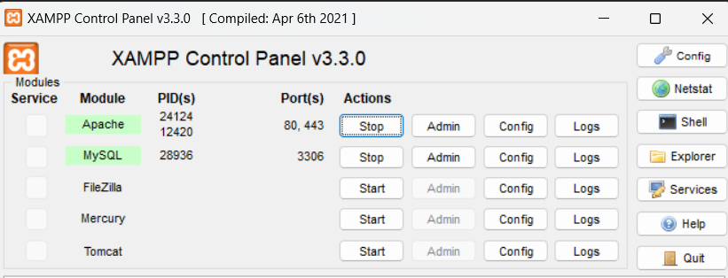

ACESSAR BANCO DE DADOS MySQL:

- http://localhost/phpmyadmin/

CRIAR APLICAÇÃO:

- XAMPP -> HTDOCS -> CRIAR PASTA

ACESSAR APLICAÇÃO:

- http://localhost/nome-da-pasta/index.php

EXECUTAR O SERVER APACHE E O GERENCIADOR MySQL

